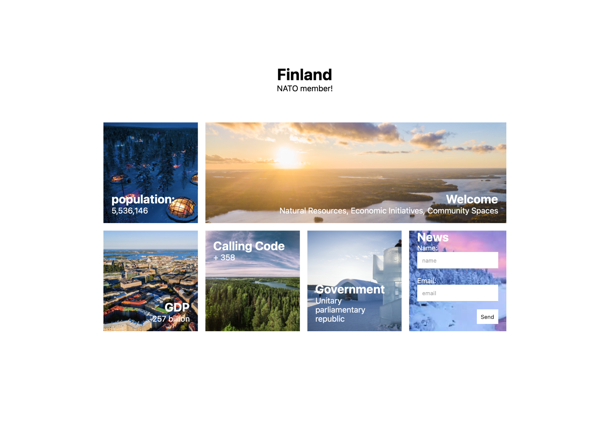
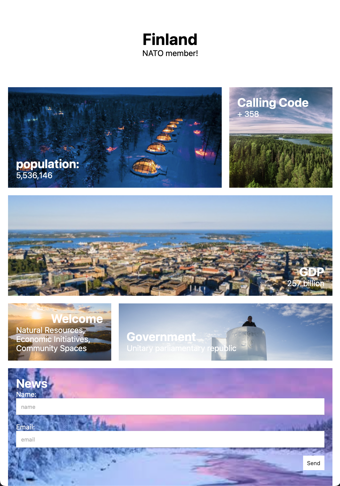
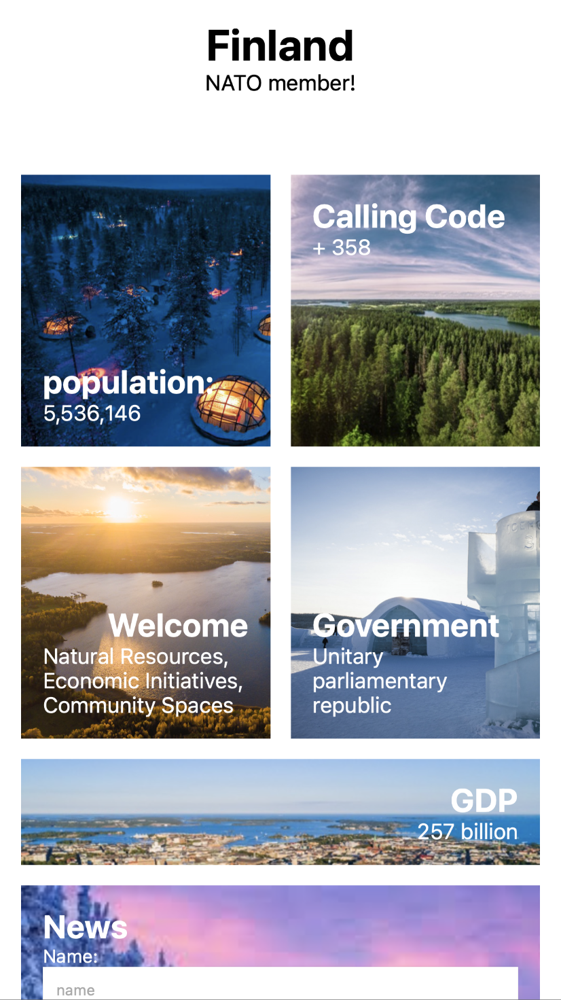

# Grid-responsive-Challenge

Finland ihas just joined NATO and is expecting an influx of turism. All those people will browsing the website with their mobile phones, it needs a responsive update! 

Take a look at the design mock ups. Your job is to recreate these. 

**Desktop**

**Tablets**

**Mobile**

The site uses 4 columns on desktop. 

For sites smaller than 800px the site should use three columns. Note the position of the GDP box. This takes up all three columns, while population and government take up twocolumns. 

For mobile the site should use two columns. 

Look at the images to visual the challenge. You'll be writing some media queries to solve this problem. # responsive-challenges
